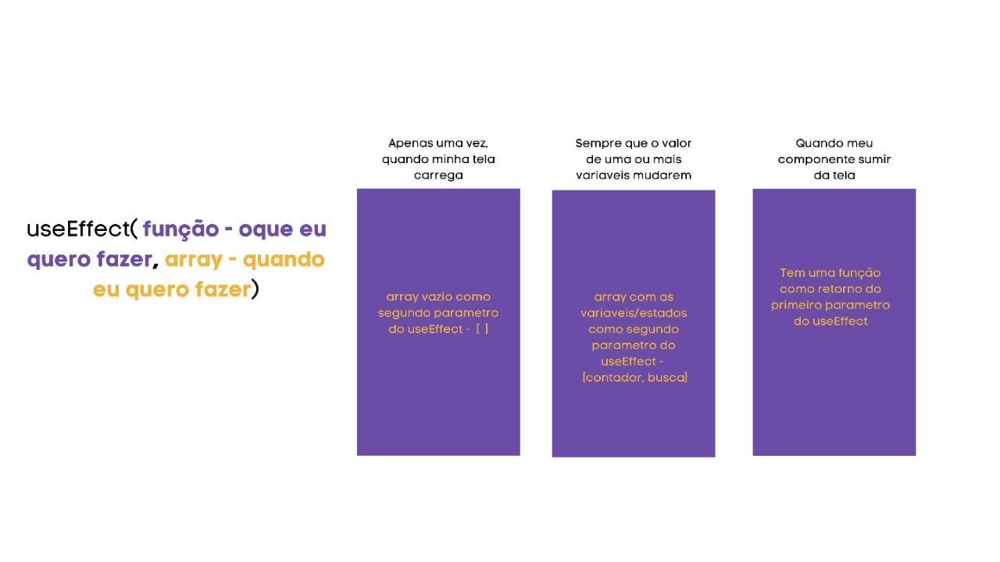

# Ciclo Formativo PretaLab | ReactJS - Aula 9 - 19/11 🚀

## ✓ UseEffect e UseState na prática

## Projetinho para casa

1. Faça um fork do seguinte repo e siga as instruções contidas no read me:
   `https://github.com/lisansouza/pretalab-ciclo6-hooks`
